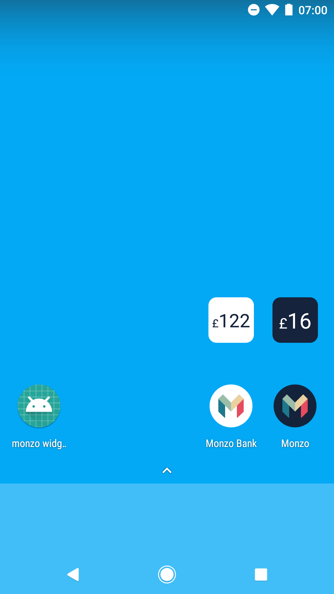

# monzo-widget

An Android app widget for your homescreen, showing the balance of your prepaid or current account.



## Getting started

Sign in to the [Monzo Developer Console](https://developers.monzo.com) and create a new _confidential_ client, and 
set the redirect url to `https://monzowidget`.

Create `gradle.properties` at the root of this project, and set the following values using your new client:

```
clientId=<your client id>
clientSecret=<your client secret>
```

Profit!